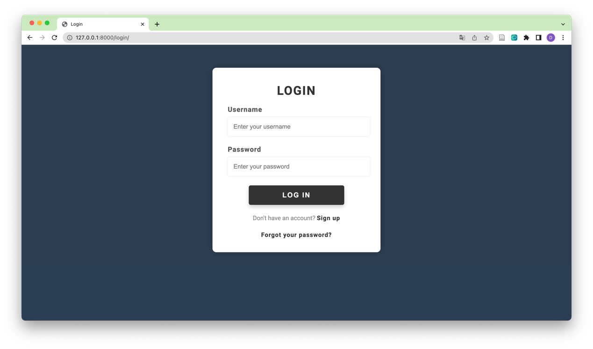
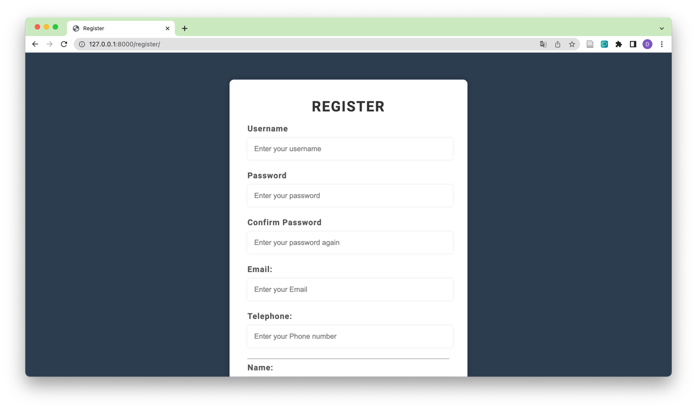
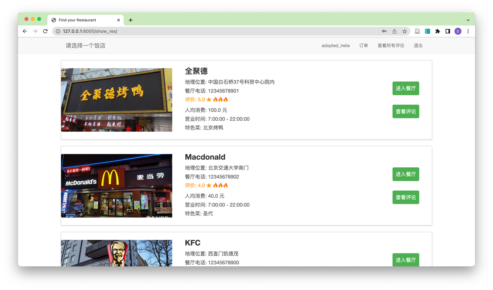
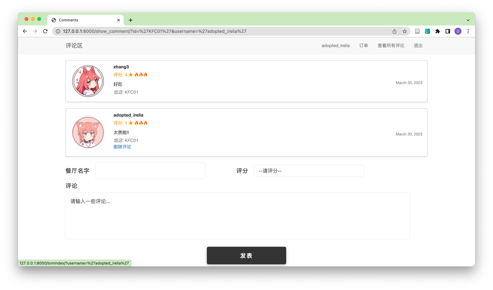
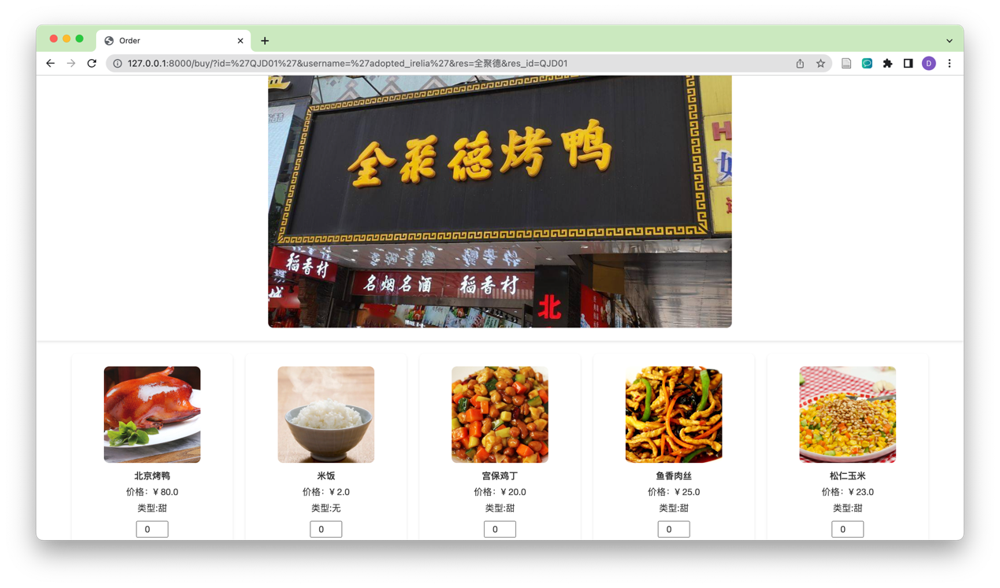
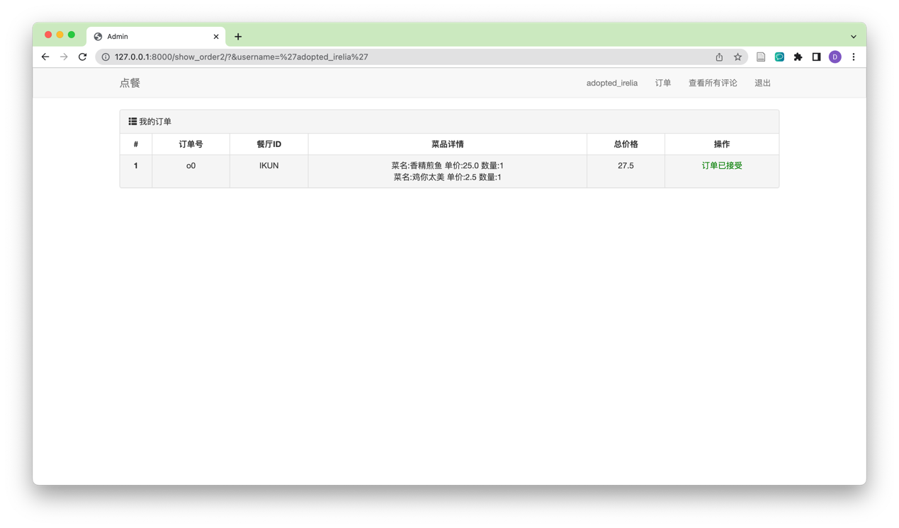
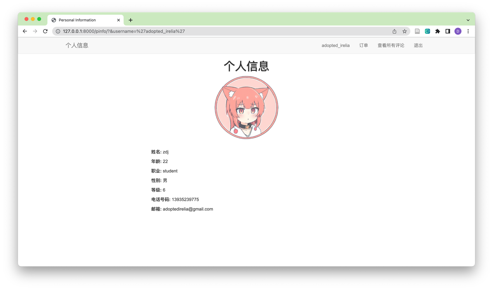

# Order-System

## requirements

- MySQL
- django

## how to set up the system

```python
cd Order-System
python manage.py runserver 127.0.0.1:8000
```

## note

Before using this system, you must configure the database environment.

## simple view

### log in 



### register



### main



### user



### the order interface




### check your order




### user information


